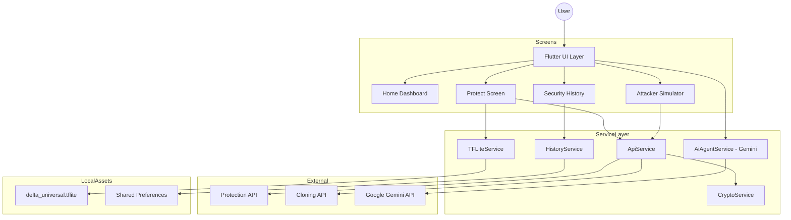

# FAKeless Security - Technical Documentation & System Reference

## 1. Executive Summary
**FAKeless Security** is a high-fidelity mobile application engineered to combat the rising threat of audio deepfakes and unauthorized voice cloning. The system provides a multi-layered defense mechanism, combining cloud-based forensic analysis with localized, on-device machine learning (TFLite) to protect and verify digital audio assets.

---

## 2. System Architecture

---

## 3. Screen-by-Screen Use Case Analysis

### 3.1 SplashScreen (`splash_screen.dart`)
*   **Use Case**: Initial brand immersion and system health check.
*   **Logic**: Verifies the presence of the `.env` file and initializes core services (`TfliteService`, `CryptoService`) before navigating to the onboarding or home screen.

### 3.2 OnboardingScreen (`onboarding_screen.dart`)
*   **Use Case**: User education for first-time security analysts.
*   **Interaction**: Progressive disclosure of features (Protection vs. Detection) using high-quality Lottie animations.

### 3.3 MainShell (`main_shell.dart`)
*   **Use Case**: The "Master Control" of the application.
*   **Role**: Manages the `IndexedStack` for seamless navigation and hosts the **Floating AI Assistant**, ensuring security help is always one tap away regardless of the current screen.

### 3.4 HomeScreen (`home_screen.dart`)
*   **Use Case**: Security Status Hub.
*   **Features**:
    - **Hero Section**: Quick-access button to start audio protection.
    - **Live Stats**: Real-time count of protected files from `HistoryService`.
    - **Metric Education**: Deep dive into **PESQ** (Quality) and **STOI** (Intelligibility) scores to help users understand security tradeoffs.

### 3.5 ProtectScreen (`protect_screen.dart`)
*   **Use Case**: Active Audio Defensive Layer.
*   **Detailed Workflow**:
    1.  **Input**: User records audio (PCM 16k WAV) or uploads a file.
    2.  **Analysis**: The `TfliteService` analyzes the audio and recommends a "Protection Scale" (1-5).
    3.  **Defense**: User applies a watermark via the `ApiService` (Cloud) or `TfliteService` (Local Fallback).
    4.  **Verification**: Generates a **Protection Certificate** and displays a side-by-side **Waveform Comparison**.

### 3.6 DetectScreen (`detect_screen.dart`)
*   **Use Case**: Adversarial Attack Simulation (The "Red Team" tool).
*   **Detailed Workflow**:
    1.  **Cloning Interface**: Allows a user to input "Target Text."
    2.  **API Execution**: Sends the source audio and text to a remote cloning model.
    3.  **Validation**: Users listen to the "Cloned" output to verify if the protection applied in the previous step successfully disrupted the cloning process.

---

## 4. UI Component (Widget) Catalog

| Component | File | Use Case / Logic |
| :--- | :--- | :--- |
| **Floating Assistant** | `floating_ai_assistant.dart` | Persistent Gemini chat UI. Handles voice commands and file uploads conversationally. |
| **Wav Visualizer** | `waveform_visualizer.dart` | Custom-painter based waveform. Used to audit the "Adversarial Noise" applied during protection. |
| **A/B Comparison** | `ab_comparison_player.dart` | Synchronized audio playback for comparing Original vs. Protected/Cloned audio. |
| **Level Meter** | `level_meter.dart` | Real-time decibel tracking to ensure recording quality is sufficient for ML analysis. |
| **Protection Cert** | `protection_certificate.dart` | Visual "Proof of Security" card displaying model version, scale, and time-thwarted stats. |

---

## 5. Service Layer Specification

### 5.1 `AiAgentService` (The Brain)
*   **Technology**: Google Gemini Pro API.
*   **Use Case**: Interprets user intent. If a user says "Protect this audio at maximum level," the service identifies the "intent" and returns a structured action that the UI uses to trigger `_submitProtection(5)`.

### 5.2 `TfliteService` (Edge Intelligence)
*   **Model**: `delta_universal.tflite` (8-bit quantized).
*   **Use Case**: Performs local signal processing. If the device is offline, this service applies a "Universal Watermark" layer directly to the WAV bytes without cloud dependency.

### 5.3 `ApiService` (Cloud Integration)
*   **Network**: HTTPS Multipart requests.
*   **Endpoints**:
    - `/protect`: Applies advanced adversarial perturbation.
    - `/detect`: Forensic analysis of audio segments.

### 5.4 `HistoryService` (Audit Trail)
*   **Persistence**: `SharedPreferences` + `JSON` Serialization.
*   **Use Case**: Maintains a permanent record of every protection session, allowing users to share or re-verify protected audio from weeks ago.

---

## 6. Technical Requirements & Deployment

### 6.1 Environment (`.env`)
The app requires an environment file bundled in assets:
- `GEMINI_API_KEY`: Required for the Chat Intelligence.
- `PROTECTION_API_ENDPOINT`: URL for the cloud protection model.

### 6.2 Permission Handlers
The system implements strict permission checks for:
- `Permission.microphone`: For recording audio.
- `Permission.storage`: For saving/loading `.wav` files.

---

## 7. Security & Data Privacy
- **Encryption**: `CryptoService` uses AES-256 to obfuscate local path identifiers in the preference store.
- **Data Lifecycle**: Voice recordings are treated as ephemeral. Any temporary file generated during the "Trim" or "Protect" process is stored in the `TemporaryDirectory` and cleaned up by the OS when space is needed.

---

## 8. Maintenance Guide
- **Updating Models**: Replace `assets/models/delta_universal.tflite` and update the version string in `TfliteService`.
- **UI Refresh**: Centralized styles are located in `lib/core/theme.dart`. Modernizing the app-wide look only requires updating the `AppTheme` class.

**FAKeless Security v1.0.0**  
*Documentation updated: April 2026*
